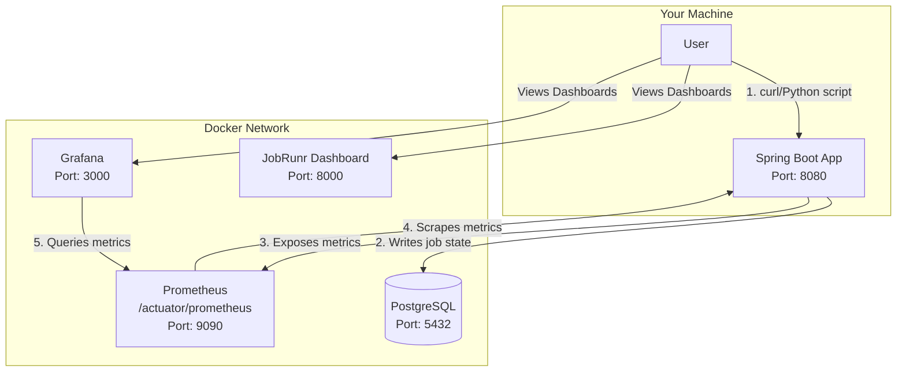

# Distributed Job Scheduling System


A production-ready, distributed job scheduling system designed to offload long-running background tasks from a primary web application. This project demonstrates a complete, end-to-end implementation of a scalable and resilient microservice architecture, including persistent storage, a full observability stack, and complete containerization for easy deployment.

---

## 🚀 Key Features

-   **Distributed Job Scheduling**: Utilizes **JobRunr** to enqueue, schedule, and process background jobs across multiple workers, ensuring high availability and throughput.
-   **Persistent Job Storage**: Integrates with **PostgreSQL** to provide a durable and reliable storage backend. Jobs are never lost, even if the application restarts.
-   **Full Observability Stack**: Exposes detailed application and performance metrics using **Spring Boot Actuator** and **Micrometer**. These metrics are scraped by **Prometheus** and visualized in **Grafana** with a pre-configured dashboard.
-   **Containerized with Docker**: The entire system—including the application, database, and monitoring tools—is containerized using **Docker** and orchestrated with **Docker Compose**, allowing for one-command setup and a consistent development environment.
-   **Resilient and Scalable Architecture**: Built with modern best practices, including database connection pooling, asynchronous task execution, and healthchecks to handle race conditions and ensure service reliability.
-   **Simple REST API**: Provides a straightforward REST API for enqueuing new jobs.

---

## 🛠️ Tech Stack

| Component              | Technology                                                                                                    |
| ---------------------- | ------------------------------------------------------------------------------------------------------------- |
| **Backend**            | Java 17, Spring Boot                                                                                          |
| **Job Scheduling**     | JobRunr                                                                                                       |
| **Database**           | PostgreSQL (for persistence), H2 (for unit tests)                                                             |
| **Observability**      | Spring Boot Actuator, Micrometer, Prometheus, Grafana                                                         |
| **Containerization**   | Docker, Docker Compose                                                                                        |
| **Build Tool**         | Maven                                                                                                         |
| **Load Testing Script**| Python 3, Requests                                                                                            |

---

## 🏛️ System Architecture

The system is composed of four main services that are orchestrated by Docker Compose. They communicate with each other over a shared Docker network.



---

## 🏁 Getting Started

Thanks to Docker, you do **not** need to install Java, Maven, or PostgreSQL locally. You only need Git and Docker.

### Prerequisites

-   [Git](https://git-scm.com/)
-   [Docker Desktop](https://www.docker.com/products/docker-desktop/) (or Docker Engine on Linux)

### Installation & Setup

1.  **Clone the repository:**
    ```bash
    git clone https://github.com/verma-divyanshu-git/Distributed-Job-Scheduling-System.git
    cd Distributed-Job-Scheduling-System
    ```

2.  **Ensure Docker is running:**
    Open Docker Desktop or run `docker --version` to confirm the Docker daemon is active.

---

## 🏃‍♀️ How to Run the System

The entire system can be started with a single command from the project's root directory.

```bash
docker-compose up --build
```

-   `--build`: This flag tells Docker Compose to build the application image from the `Dockerfile`. You only need to use it the first time you run the system or after making changes to the application code or `Dockerfile`.
-   The command will download all necessary images (Postgres, Prometheus, Grafana), build your application, and start all four containers.

Wait for the logs to stabilize. You will see output from all services. The system is ready when the logs stop scrolling rapidly.

---

## 🧪 How to Test the System

Once the system is running, you can test each component.

### 1. The Application API & JobRunr Dashboard

-   **Enqueue Jobs via `curl`**:
    Open a new terminal and run these commands to create some jobs.
    ```bash
    # Enqueue a simple, fast job
    curl http://localhost:8080/jobs/simple-job?name=MyFirstJob

    # Enqueue a job that takes several minutes
    curl http://localhost:8080/jobs/long-running-job
    ```

-   **Check the JobRunr Dashboard**:
    Open your browser and navigate to **[http://localhost:8000](http://localhost:8000)**. You will see your jobs being processed in real-time.

### 2. The Prometheus Monitoring Target

-   **Access the Prometheus UI**:
    Navigate to **[http://localhost:9090](http://localhost:9090)**.

-   **Verify the Target**:
    Click on **Status** -> **Targets**. You should see a target named `spring-boot-app` with a green **UP** status, confirming that Prometheus is successfully scraping metrics from your application.

### 3. The Grafana Visualization Dashboard

-   **Access Grafana**:
    Navigate to **[http://localhost:3000](http://localhost:3000)**.

-   **Log In**:
    -   Username: `admin`
    -   Password: `admin`
    (You can skip the password change prompt for now).

-   **Add the Prometheus Data Source**:
    1.  Go to **Connections** (plug icon) > **Data sources** > **Add data source**.
    2.  Select **Prometheus**.
    3.  Set the **Prometheus server URL** to `http://prometheus:9090`.
    4.  Click **Save & test**. You should see a green success message.

-   **Import the Dashboard**:
    1.  Go to **Dashboards** (four-square icon) > **New** > **Import**.
    2.  In the "Import via grafana.com" field, enter the ID `12900` and click **Load**.
    3.  On the next screen, select your `Prometheus` data source from the dropdown menu at the bottom.
    4.  Click **Import**.

You will now have a complete dashboard visualizing your application's live metrics!

---

## 🌪️ Load Testing

To see more dramatic changes in the Grafana graphs, you can run the included Python script to enqueue dozens of jobs at once.

### Prerequisites

-   Python 3
-   The `requests` library. Install it via pip:
    ```bash
    pip install requests
    ```

### Run the Load Test

While viewing your Grafana and JobRunr dashboards, run the script from your terminal:

```bash
python load_test.py
```

Watch the dashboards come to life! You will see spikes in CPU usage, memory consumption, active database connections, and job processing rates.

---

## 📁 Project Structure

```
.
├── Dockerfile                # Defines how to build the application image
├── docker-compose.yml       # Orchestrates all services (app, db, prometheus, grafana)
├── pom.xml                  # Maven project configuration and dependencies
├── load_test.py             # Script for load testing the API
├── monitoring/
│   └── prometheus.yml       # Prometheus configuration to scrape the app
└── src/
    ├── main/
    │   ├── java/            # Application source code
    │   └── resources/
    │       └── application.properties # Spring Boot configuration
    └── test/                # Unit and integration tests
```